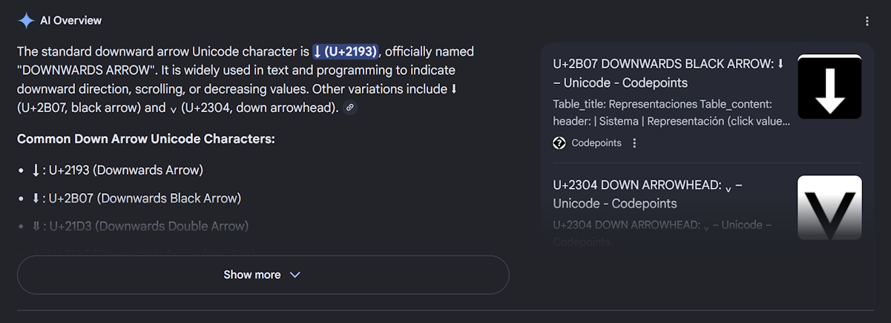
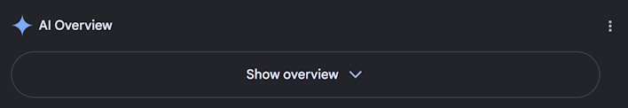
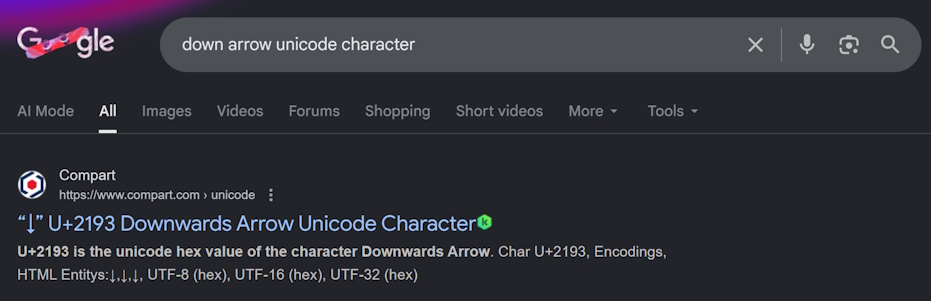
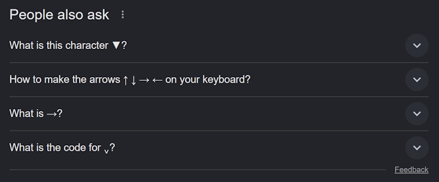
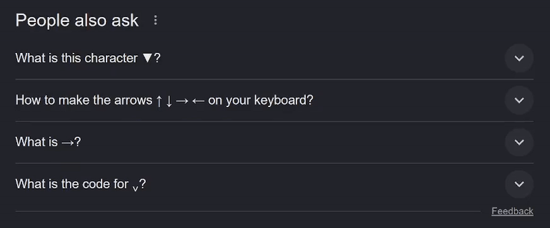
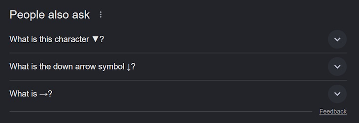

# Settings for Google AI

Provides settings for all\* AI features in Google search.

\* This project is unfinished.

## AI Overview

When Google believes it has enough information to give a good summary of your query it will generate and display an AI Overview snippet.

<!-- This feature is slowly replacing regular featured snippets as they can spotlight multiple sources and give a more holistic view of a given topic. Please note that this claim is largely anecdotal and I couldn't find anything published by Google to back up my claims, [though there is some evidence of featured snippets decline](https://keywordseverywhere.com/blog/are-featured-snippets-still-a-thing-2025-seo-guide/#:~:text=Recent%20studies%20also%20show%20that,15.41%25%20to%20just%205.53%25.). -->

### modes

#### visible

This is the standard way Google shows AI Overviews. No changes at all. Perfect if you like how AI Overviews are presented and/or are here for Settings for Google AI's other features.

#### condensed

This is a personal preference. Removes all\* the attention grabbing animations and condenses the overview so you have to reach for it, not the other way around. No page re-shuffling, just a tool for you to use.

\* note: status text like "Thinking" & "Searching" will still appear, however they are sized identically and will not shift the page's content.

#### hidden

Completely removes the AI Overview along with any padding it may have brought - like it was never there at all. Perfect for those who dispise everything AI stands for.

(there was an AI Overview snippet above the link)

## AI in "People also ask"

AI overviews can also be found amongst the traditional featured snippets in "People also ask" sections. They are identical in nature to regular AI Overviews.

### modes

#### normal

This is the standard way Google shows AI Overviews in "People also ask" sections. No changes at all. Perfect if you like how People also ask sections are presented and/or are here for Settings for Google AI's other features.

#### labelled

Brings the AI Overview label out from the collapsed view so you know what you're in for.

Due to how the scripts are currently setup (and how the suggested snippets content is sent after the rest of the page) it can take a little while for the labels to popup. Thus, they have a toggable\* animated entrance animation.

\* This has not been implemented yet.

##### settings

> [!WARNING]
> TODO: This is not yet implemented.

#### hidden

> [!WARNING]
> TODO: This feature is still being worked on. It may change in the future.

Completely removes the AI Overview snippets from the People also ask sections.

## Installation

> [!NOTE]
> This will be put on the Chrome Web Store when it is closer to completion.

1. Download the project.
   Whether through cloning the repo or by downloading the [latest zip](https://github.com/Aerodynamax/settings-for-google-ai/archive/refs/heads/main.zip).

2. Extract the zip to a new/empty folder (if you cloned the repo you can ignore this step).

3. Go to manage extensions (on Chrome: [chrome://extensions](chrome://extensions)).

4. Enable "developer mode" (on Chrome: there is a toggle in the top right of the page).

5. Press the "Load unpacked" button and select the folder where you extracted the zip file to (or where you cloned down the repo to).

6. Enjoy!
